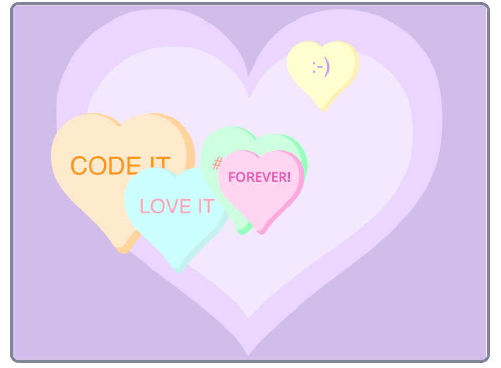

## Introduction
You’re going to create a fun game to try and improve a user’s concentration and help them focus and relax. You will choose a theme for your project.

## Skills you should have
To complete this Same but different project you need to have the following skills which you will have learnt when completing [Focus on the prize]https://learning-admin.raspberrypi.org/en/projects/focus-on-the-prize):
- How to use `broadcasts`{:class="block3control"} to communicate between sprites
- How to detect when two sprites are `touching`{:class="block3sense"} each other
- How to use `and`{:class="block3operators"} and `not`{:class="block3operators"} Boolean operators 

You will now apply these skills to create your own project where you will choose your own sprites and backdrop to create a unique animation.

## What you will make
ADD IN images/ WHEN YOU HAVE CREATE THE FOLDER!
--- no-print ---
Click on the green flag to see an example project:

  <iframe allowtransparency="true" width="485" height="402" src="https://scratch.mit.edu/projects/embed/411558897/?autostart=false" frameborder="0"></iframe>

--- /no-print ---

--- print-only ---
{:width="400px"}
--- /print-only ---

--- collapse ---
---
title: What you will need
---
### Hardware

+ A computer or tablet capable of running Scratch

### Software

+ Scratch 3.0 (either [online](http://rpf.io/scratchon) or [offline](http://rpf.io/scratchoff))

--- /collapse ---

--- collapse ---
---
title: What you will learn
---
TRACY, WHAT AIMS TO PUT IN?

+ How to apply your skills to realise your own project ideas
+ How to debug your program
+ How to reflect on your learning

+ How to select suitable sprites to match your ideas
+ How to adapt costumes to create a realistic animation
+ How to adapt a sprite’s position and movement to create a working game
+ How to change each sprite’s touching colour ? so they can avoid touching each other
+ How to identify which sprites, costumes, values (Motion block and touching colour ?) to adapt in order to realise your creative ideas

--- /collapse ---

--- collapse ---
---
title: Additional information for educators
---
TRACY, DO WE NEED A STARTER PROJECT?

[Here](http://rpf.io/project-name-go) is a link to the resources for this project.

If you need to print this project, please use the [printer-friendly version](https://projects.raspberrypi.org/en/projects/project-name/print){:target="_blank"}.

--- /collapse ---
