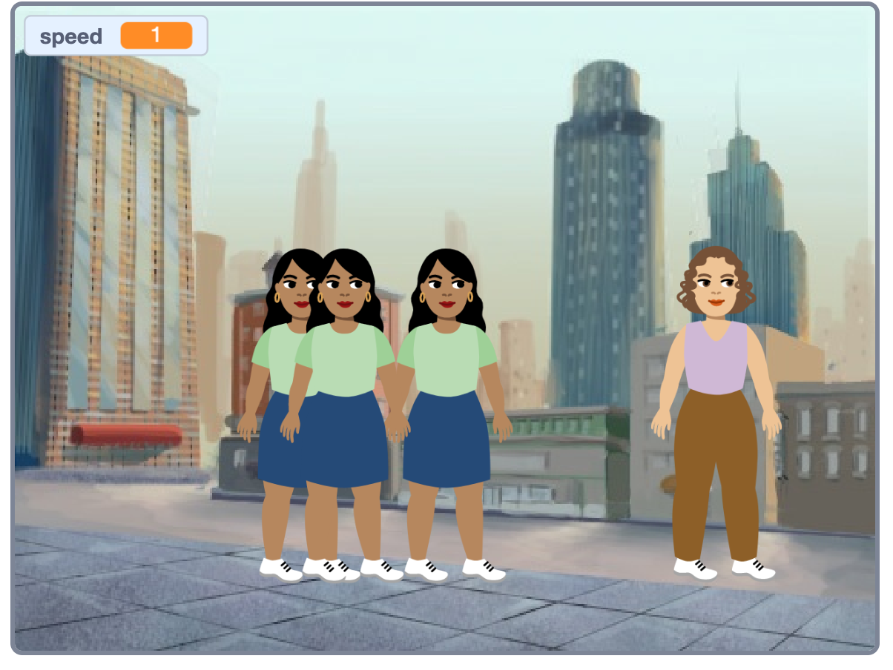

## Introduction
A user is anybody who utilises a computer for work and/or play.

Focusing help to relax - you’re going to create a fun game to improve a user’s concentration. You will choose an overall theme for your project.

## Skills you should have
To complete this Same but different project you need to have the following skills which you will have learnt when completing [Focus on the prize](https://learning-admin.raspberrypi.org/en/projects/focus-on-the-prize):
- How to use `broadcasts`{:class="block3control"} to communicate between sprites
- How to detect when two sprites are `touching`{:class="block3sense"} each other
- How to use `and`{:class="block3operators"} and `not`{:class="block3operators"} Boolean operators 

You will now apply these skills to create your own project where you will choose your own sprites and backdrop to create a unique game.

## What you will make

--- no-print ---

Click on the green flag to see an example project:

  <iframe allowtransparency="true" width="485" height="402" src="https://scratch.mit.edu/projects/embed/411558897/?autostart=false" frameborder="0"></iframe>

--- /no-print ---

--- print-only ---

Heere's an example project:

{:width="420px"}

--- /print-only ---

--- collapse ---
---
title: What you will need
---
### Hardware

+ A computer or tablet capable of running Scratch

### Software

+ Scratch 3.0 (either [online](http://rpf.io/scratchon) or [offline](http://rpf.io/scratchoff))

--- /collapse ---

--- collapse ---
---
title: What you will learn
---
+ How to use your skills and experience to realise a creative project
+ How to investigate other Scratch projects and investigate How to... in order to develop your ideas
+ How to share your project to a wide community of users
--- /collapse ---

--- collapse ---
---
title: Additional information for educators
---
If you need to print this project, please use the [printer-friendly version](https://projects.raspberrypi.org/en/projects/project-name/print){:target="_blank"}.

--- /collapse ---
