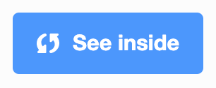

## Get inspiration
Now it's time to think about your project. You need to make a Same but different game to focus the mind. The theme, sprites and costumes are up to you.

You are going to create a game to help the player focus their mind. The theme, sprites and costumes will be completely up to you. 

It is great to get ideas for your same but different game project by investigating projects created by others. 

--- task ---

--- no-print ---

Have a look at the [Same but different](https://scratch.mit.edu/studios/27154226){:target="_blank"} projects below from the Raspberry Pi Foundation Scratch studio.

Click the green flag on a project to see the code run.

Click `See inside`{:class="block3motion"} below a project to investigate its code.

**Tip:** Explore the first sprite's costumes. Adapting costumes is a great way to simply create an animated sprite.

--- /no-print ---

--- print-only ---

Go to the [Same but different](https://scratch.mit.edu/studios/27154226) Scratch studio.

Try out each of these different mind focussing games to get inspiration for the game you are about to make.

Click `See inside`{:class="block3motion"} to investigate how the projects were made.

**Tip:** Explore the first sprite's costumes. Adapting costumes is a great way to simply create an animated sprite.

--- /print-only ---

--- /task ---

--- no-print ---

--- task ---

Investigate the **Focus on the prize** Scratch project.

  <iframe src="https://scratch.mit.edu/projects/405012286/embed" allowtransparency="true" width="485" height="402" frameborder="0" scrolling="no" allowfullscreen></iframe>

{:target="_blank"}

--- /task ---

--- task ---

Investigate the **Follow the bunny** Scratch project.

  <iframe src="https://scratch.mit.edu/projects/411775881/embed" allowtransparency="true" width="485" height="402" frameborder="0" scrolling="no" allowfullscreen></iframe>

{:target="_blank"}

--- /task ---

--- task ---

Investigate the **Which triplet ate the doughnut?** Scratch project.

  <iframe src="https://scratch.mit.edu/projects/411558897/embed" allowtransparency="true" width="485" height="402" frameborder="0" scrolling="no" allowfullscreen></iframe>

{:target="_blank"}

--- /task ---

--- task ---

Investigate the **Who laid the golden egg?** Scratch project.

  <iframe src="https://scratch.mit.edu/projects/411559122/embed" allowtransparency="true" width="485" height="402" frameborder="0" scrolling="no" allowfullscreen></iframe>

{:target="_blank"}

--- /task ---

--- /no-print ---

*[algorithm]: A set of precise instructions for performing a task.
